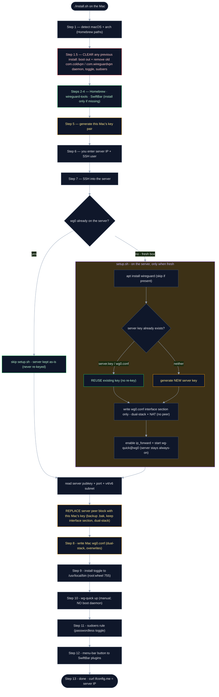
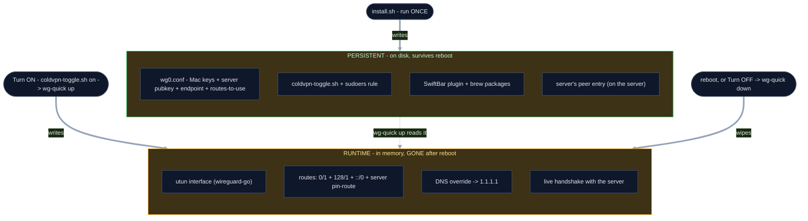

# Developer Guide

For anyone who wants to understand, modify, or contribute to ColdVPN. Every step
that `install.sh` and `server/setup.sh` automate is documented here manually — so
you can run each piece by hand, tweak it, and see exactly what's happening.

🔗 [Main README](README.md) · 📐 [ARCHITECTURE.md](client/ARCHITECTURE.md)

---

## Project structure

```
ColdVPN/
├── install.sh                          ← Mac client installer (wraps Part 2)
├── client/
│   ├── wg0.conf.example                ← Mac WireGuard config template
│   ├── coldvpn-toggle.sh          ← on/off/toggle/status switch
│   ├── coldvpn.5s.sh                   ← SwiftBar menu-bar on/off button
│   ├── coldvpn-monitor                      ← dev widget: client + server health (optional)
│   ├── coldvpn-monitor.swift                ← native menu-bar app for coldvpn-monitor (optional)
│   └── decisions/                      ← architecture decision notes
└── server/
    ├── setup.sh                        ← VPS server installer (wraps Part 1)
    └── wg0.conf.example                ← server WireGuard config template
```

The tunnel is brought up and down by hand — a menu-bar button toggles it, and
nothing starts it automatically, so after a reboot it's off until you turn it on.
There is no boot service.

---

## What `install.sh` does — the whole flow

Step by step, including what it **keeps** vs **overrides** on each run, and the
conditional `setup.sh` branch on the server.



**Colour key:** green = kept / reused · amber = regenerated or replaced on every
run · red = removed. The takeaway: a re-run **never re-keys an existing server**
(skips `setup.sh`, and even a manual `setup.sh` reuses the saved key) — it only
regenerates the *Mac's* keys and re-registers them as the server's single peer.

## Do we need to reinstall every time?

`install.sh` writes the **persistent** layer once (it survives reboots). The
menu-bar **Turn ON** runs `wg-quick up`, which builds the **runtime** layer each
time by *reading* that persistent config. A reboot — or **Turn OFF**
(`wg-quick down`) — wipes only the runtime layer; nothing re-runs `install.sh`.



So: green = written once by `install.sh`, stays. Amber = written by `wg-quick up`
(Turn ON) every time, gone on reboot/Turn OFF — and rebuilt from the green layer
the next time you turn it on. **No reinstall needed, ever.**

The manual steps below are the same flow, one command per piece.

---

## Part 1 — Server setup (run on your Ubuntu VPS)

> **Prerequisite (not scripted):** create the VM first in your cloud console —
> an **Ubuntu 22.04** Always-Free instance, add your **SSH public key**, note the
> **public IP**, and open **UDP 443** in the cloud firewall (Oracle: VCN →
> Security Lists → Add Ingress Rule). Then SSH in and run the steps below.

### Step 1 — Install WireGuard
```bash
apt update && apt install -y wireguard wireguard-tools iptables
```

### Step 2 — Generate server key pair
```bash
wg genkey | tee /etc/wireguard/server_private.key | wg pubkey > /etc/wireguard/server_public.key
chmod 600 /etc/wireguard/server_private.key
cat /etc/wireguard/server_public.key   # needed for the Mac setup
```

### Step 3 — Find your network interface
```bash
ip route | grep default | awk '{print $5}'   # usually ens3 / enp0s3 / eth0
```

### Step 4 — Enable IP forwarding
```bash
echo "net.ipv4.ip_forward=1"          >> /etc/sysctl.conf
echo "net.ipv6.conf.all.forwarding=1" >> /etc/sysctl.conf
sysctl -p
```

### Step 5 — Create server config
```bash
cp server/wg0.conf.example /etc/wireguard/wg0.conf
nano /etc/wireguard/wg0.conf
#   PrivateKey → contents of server_private.key
#   ens3       → your interface from Step 3
#   ListenPort → 443
#   Address    → 10.8.0.1/24
#   PublicKey  → your Mac's public key (Part 2, Step 2)
```

> **Oracle gotcha:** the PostUp `FORWARD` rule must be **inserted above** Oracle's
> default REJECT — use `iptables -I FORWARD 1 -i wg0 -j ACCEPT`, **not** `-A`.
> Append (`-A`) lands below the REJECT and clients get no internet even though the
> handshake succeeds. `setup.sh` already does the insert.

### Step 6 — Start WireGuard
```bash
systemctl enable wg-quick@wg0
systemctl start  wg-quick@wg0
systemctl status wg-quick@wg0
```

### Step 7 — Open firewall port
```bash
ufw allow 443/udp   # if ufw is active
# Cloud firewall (Oracle): Networking → VCN → Security Lists → Add Ingress Rule
#   Protocol UDP, Port 443
```

---

## Part 2 — Mac client setup (run on your Mac)

### Step 1 — Install WireGuard tools
```bash
brew install wireguard-tools
```

### Step 2 — Generate client key pair
```bash
wg genkey | tee ~/.wg-private.key | wg pubkey > ~/.wg-public.key
cat ~/.wg-public.key   # paste into the server's wg0.conf [Peer]
```

### Step 3 — Add your public key to the server
```ini
# in /etc/wireguard/wg0.conf on the server
[Peer]
PublicKey  = YOUR_MAC_PUBLIC_KEY
AllowedIPs = 10.8.0.2/32
```
```bash
systemctl restart wg-quick@wg0   # on the server
```

### Step 4 — Create Mac WireGuard config
```bash
sudo cp client/wg0.conf.example /opt/homebrew/etc/wireguard/wg0.conf
sudo nano /opt/homebrew/etc/wireguard/wg0.conf
#   PrivateKey → contents of ~/.wg-private.key
#   PublicKey  → your server's public key
#   Endpoint   → your server IP:443
#   Address    → 10.8.0.2/32
```

### Step 5 — Install the toggle script (root-owned)
```bash
sudo cp client/coldvpn-toggle.sh /usr/local/bin/coldvpn-toggle.sh
sudo chown root:wheel /usr/local/bin/coldvpn-toggle.sh
sudo chmod 755 /usr/local/bin/coldvpn-toggle.sh
```
Root-owned + not user-writable is what makes the passwordless sudoers rule safe.

### Step 6 — Configure sudoers (toggle without a password)
The menu-bar button must run the toggle as root with no password prompt. This
rule grants passwordless `sudo` for **only** that one script — safe *because* the
script is root-owned and not user-writable (Step 5). `install.sh` writes this rule
itself; there's no `.sudoers` file to copy.
```bash
echo "$(whoami) ALL=(root) NOPASSWD: /usr/local/bin/coldvpn-toggle.sh" \
    | sudo tee /etc/sudoers.d/coldvpn
sudo chmod 440 /etc/sudoers.d/coldvpn
```

### Step 7 — Install the menu-bar button
```bash
brew install --cask swiftbar
cp client/coldvpn.5s.sh ~/swiftbar-plugins/coldvpn.5s.sh
chmod +x ~/swiftbar-plugins/coldvpn.5s.sh
```

### Step 8 — Test
```bash
/usr/local/bin/coldvpn-toggle.sh on
curl -s https://ifconfig.me      # should print your server's public IP
/usr/local/bin/coldvpn-toggle.sh off
```

---

## How each piece works

### `client/coldvpn-toggle.sh`
The one switch: `on` brings the tunnel up (`wg-quick up`), `off` brings it down
(`wg-quick down`), `toggle` flips, `status` prints `on`/`off` (used by the
menu-bar button). No boot daemon — nothing starts it automatically. Runs as root
via the scoped sudoers rule.

### `client/coldvpn.5s.sh`
SwiftBar plugin (refreshes every 5s). Calls `coldvpn-toggle.sh status` and
renders a 🟢/🔴 button that flips the VPN on/off.

### `client/coldvpn-monitor` + `coldvpn-monitor.swift` (optional dev widget)
A richer health view than the simple toggle button: client transfer/status plus
server load/connections/latency pulled over SSH. `coldvpn-monitor` is the CLI
(`--json` for the menu-bar app, `--watch` to refresh in the terminal);
`coldvpn-monitor.swift` is the native menu-bar app that renders its JSON. Configure via
`~/.coldvpn-monitor.conf` (`WG_IFACE`, `SERVER_SSH`). Not installed by `install.sh` —
it's for developers who want live client+server stats.

### `server/setup.sh`
Runs all of Part 1 automatically on the VPS.

---

## Contributing

1. Fork the repo
2. Edit the scripts in `client/` or `server/`
3. Test manually using the steps above
4. Open a PR describing what changed and why

### Testing a change to the toggle
```bash
nano client/coldvpn-toggle.sh
sudo cp client/coldvpn-toggle.sh /usr/local/bin/coldvpn-toggle.sh
sudo /usr/local/bin/coldvpn-toggle.sh status
```
