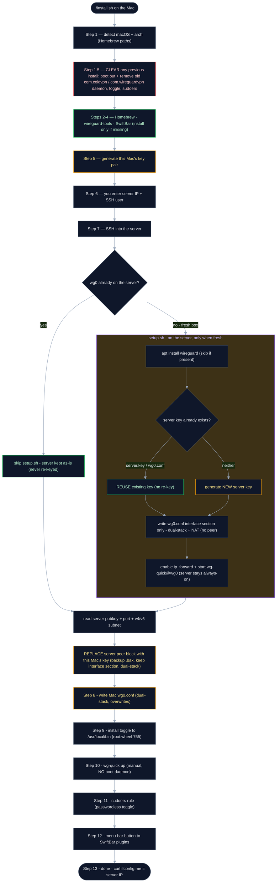

# ColdVPN

A **self-hosted WireGuard VPN** for your Mac. Route *all* your traffic through a
cloud server **you own** — instead of trusting a third-party VPN provider.

```
your Mac → [WireGuard encrypted tunnel] → your server → internet
```

A 🟢/🔴 menu-bar button turns the tunnel on and off. Nothing starts it
automatically — after a reboot it's off until you switch it on.

---

## Setup

Two things you do by hand — everything after is automatic.

### 1 · Create the server VM

A free **Oracle Cloud** Ubuntu instance, with **UDP 443** open. One-time, in the
cloud console. → [server/CREATE-VM.md](server/CREATE-VM.md)

### 2 · Run the installer on your Mac

```bash
git clone https://github.com/codereyinish/ColdVPN.git
cd ColdVPN
./install.sh
```

Partway through, it asks you for two things:

- **Server public IP** — Oracle console → *Instances → your instance → Public IP address*
- **SSH username** — `ubuntu` (Oracle's default image)

Enter those — that's the last thing you do by hand.

When it finishes, the **ColdVPN** button shows up in your menu bar — click it to
switch the tunnel on or off:

| off | on |
|:---:|:---:|
|  |  |

### Test it's working

```bash
curl ifconfig.me
```

It should print your **server's IP** — not your home one. Click the menu-bar
button to toggle the tunnel off and back on.

> **Prefer no scripts?** Install **WireGuard** from the Mac App Store →
> *Add Tunnel → Import from file* → pick your `wg0.conf`. Same tunnel, native app.
> ([why](client/decisions/03-cli-vs-app.md))

---

## How it works

Left to right: your one command to a live tunnel. Each numbered stage opens up
into what happens inside it.


**Go deeper:** ① [Mac client build](client/ARCHITECTURE.md) · ② [setup.sh](server/setup.sh) + [how the VM is made](server/CREATE-VM.md) · ③ [why SSH is automated](client/decisions/06-automate-key-handoff-over-ssh.md) + [SSH trust & flaws](client/decisions/05-ssh-trust-model.md) · ④ [client build](client/ARCHITECTURE.md)

**Once it's running:** 📦 [how a packet actually flows](client/PACKET-FLOW.md) (Mac → carrier → Oracle, the two NATs, and back) · 🏗️ [the Oracle network you create](server/CREATE-VM.md) (VCN → subnet → ingress → VM)

---

## The complete flow

Every step of `./install.sh`, including what it **keeps** vs **overrides**, and
the conditional `setup.sh` branch that runs on a fresh server.



**Colour key:** green = kept / reused · amber = regenerated or replaced every run
· red = removed. Takeaway: a re-run **never re-keys an existing server** (it skips
`setup.sh`, and even a manual `setup.sh` reuses the saved key) — it only
regenerates the *Mac's* keys and re-registers them as the server's single peer.

---

## Troubleshooting

Connected but something's off? Check in this order:

- **No handshake / won't connect** — UDP 443 isn't open in the cloud firewall, or the server IP / port / key is wrong.
- **Connects, but no internet** — IP forwarding or NAT isn't active on the server. *(Oracle's image also ships a default `FORWARD … REJECT` rule; `setup.sh` inserts WireGuard's accept rule above it.)*
- **Pages won't resolve** — DNS; check the `DNS =` line in your `wg0.conf`.
- **Real IP leaking on IPv6** (`curl ifconfig.me` ≠ `curl -4`) — `install.sh` routes `::/0` only if the server has IPv6 (address on `wg0` + ip6tables `MASQUERADE`). IPv4-only server? Disable IPv6 on the Mac.

## Learn more
- **Why WireGuard? DNS through the tunnel?** → [client/ARCHITECTURE.md](client/ARCHITECTURE.md)
- **Every step by hand** → [DEVELOPER.md](DEVELOPER.md)
- **Design decisions** → [client/decisions/](client/decisions/)

## Layout
- [`client/`](client/) — the Mac side: installer, toggle, menu-bar button
- [`server/`](server/) — the cloud side: `setup.sh` + config template

## License
[Elastic License 2.0](LICENSE) — free for personal use, source visible,
redistribution not permitted.
