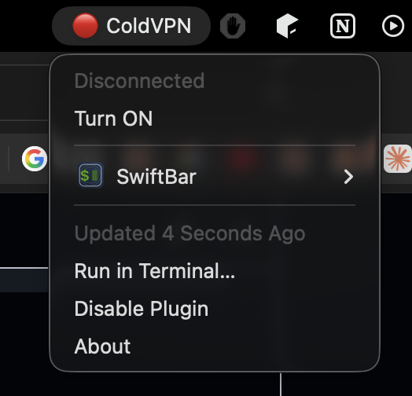
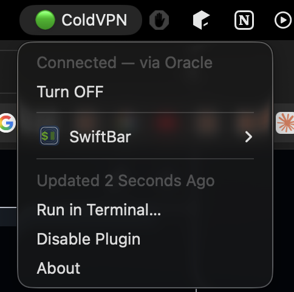
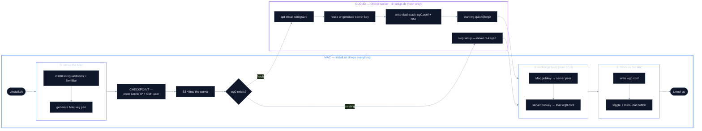

# ColdVPN

A **self-hosted WireGuard VPN** for your Mac. Route *all* your traffic through a
cloud server **you own** — instead of trusting a third-party VPN provider.

```
your Mac → [WireGuard encrypted tunnel] → your server → internet
```

Everything's local and yours: your own app (SwiftBar), your own free server
(Oracle Always-Free), and easy to install — just log in once to create the server.

## What it hides


- **Your carrier / ISP / the Wi-Fi you're on** see only encrypted packets going to
  your server on port 443. Not the sites you visit, not even their addresses — your
  DNS lookups go through the tunnel to your server too. Just one encrypted stream to
  one server.
- **A man-in-the-middle** sees the same: traffic to your server, nothing more. They
  can't read or tamper with it — only your Mac and your server hold the keys.
- **The site you visit** sees your server's IP, not your real one — your home IP and
  location stay hidden.

---

## Setup

Create an Oracle account, then run one command — everything else is automatic.

### 1 · Create a free Oracle Cloud account

The only manual step: <https://signup.cloud.oracle.com>. Signup needs card + SMS.

What you'll go through:

1. Email + country + name → verify your email
2. Set a password + an account name
3. **Choose a Home Region** — pick one near you. It's **permanent** on a free account,
   and your server must live in it, so remember which you pick.
4. Phone / SMS code
5. Credit card (identity check only — Always-Free doesn't charge you)
6. Accept → the account provisions in a few minutes, then the console loads

You'll re-enter that **Home Region** when `provision.sh` asks for a region in step 2.

### 2 · Run it — one command builds the server *and* sets up your Mac

```bash
git clone https://github.com/codereyinish/ColdVPN.git
cd ColdVPN/server/provision
./provision.sh
```

`provision.sh` does the rest, with nothing to paste:

- installs the **OCI CLI** + **Terraform** if they're missing
- **one browser login** (`oci setup bootstrap`): you log in and click *Authorize*;
  it generates an API key (a key pair) on your Mac, registers the **public** half
  on your account, and fills in `~/.oci/config` — no OCIDs or keys typed
- **Terraform** builds the VM + network, then **waits** until the server is ready
  (it's still installing WireGuard in the background)
- asks **"Configure this Mac now?"** → runs `install.sh` with the server IP handed
  over automatically, so you never copy-paste it

→ how it works, step by step: [server/provision](server/provision)
([why Terraform](client/decisions/08-provisioning-terraform.md)).

**Prefer to do it by hand?** Create the VM in the console
([server/CREATE-VM.md](server/CREATE-VM.md)), then run `./install.sh` from the repo
root — it asks for the **server IP** and **SSH user** (`ubuntu`).

When it finishes, the **ColdVPN** button shows up in your menu bar — click it to
switch the tunnel on or off:

| off | on |
|:---:|:---:|
|  |  |

### Test it's working

```bash
curl ifconfig.me
```

It should print your **server's IP** — not your home one. Click the menu-bar
button to toggle the tunnel off and back on.

**Visualize the flow above →** [How setup works](#how-setup-works)

---

## How setup works

Left to right: your one command to a live tunnel. Each numbered stage opens up
into what happens inside it.



**Go deeper:** ① [Mac client build](client/ARCHITECTURE.md) + [why not the WireGuard app](client/decisions/03-cli-vs-app.md) · ② [setup.sh](server/setup.sh) + [how the VM is made](server/CREATE-VM.md) · ③ [why SSH is automated](client/decisions/06-automate-key-handoff-over-ssh.md) + [SSH trust & flaws](client/decisions/05-ssh-trust-model.md) · ④ [client build](client/ARCHITECTURE.md)

**Once it's running:** 📦 [how a packet actually flows](client/PACKET-FLOW.md) (Mac → carrier → Oracle, the two NATs, and back) · 🏗️ [the Oracle network you create](server/CREATE-VM.md) (VCN → subnet → ingress → VM)

---

## Limitations

**What it does *not* hide:** the site still sees whatever your **browser/app** sends — User-Agent, cookies, logins, TLS/browser fingerprint. The server just **forwards** your packets; it doesn't add *or* strip those. So ColdVPN hides your **network identity (IP/location)**, not your **app-level identity**. For that you'd need browser-level defenses (private mode, anti-fingerprint browser), which are out of scope here.

---

## Troubleshooting

Connected but something's off? Check in this order:

- **No handshake / won't connect** — UDP 443 isn't open in the cloud firewall, or the server IP / port / key is wrong.
- **Connects, but no internet** — IP forwarding or NAT isn't active on the server. *(Oracle's image also ships a default `FORWARD … REJECT` rule; `setup.sh` inserts WireGuard's accept rule above it.)*
- **Pages won't resolve** — DNS; check the `DNS =` line in your `wg0.conf`.
- **Real IP leaking on IPv6** (`curl ifconfig.me` ≠ `curl -4`) — `install.sh` routes `::/0` only if the server has IPv6 (address on `wg0` + ip6tables `MASQUERADE`). IPv4-only server? Disable IPv6 on the Mac.

## Learn more
- **Why WireGuard? DNS through the tunnel?** → [client/ARCHITECTURE.md](client/ARCHITECTURE.md)
- **Every step by hand** → [DEVELOPER.md](DEVELOPER.md)
- **Design decisions** → [client/decisions/](client/decisions/)

## Layout
- [`client/`](client/) — the Mac side: installer, toggle, menu-bar button
- [`server/`](server/) — the cloud side: `setup.sh` + config template

## License
[Elastic License 2.0](LICENSE) — free for personal use, source visible,
redistribution not permitted.
