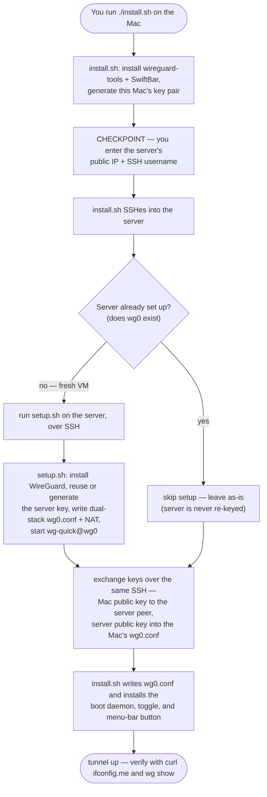

# ColdVPN

An **always-on, self-hosted WireGuard VPN** for your Mac. Route *all* your
traffic through a cloud server **you own** — instead of trusting a third-party
VPN provider.

```
your Mac → [WireGuard encrypted tunnel] → your server → internet
```

It comes up by itself at boot on **any** network, and a 🟢/🔴 menu-bar button
toggles it on/off. No carrier tricks, no bypass — just a clean VPN to a box you
control.

---

## Setup

Two things you do by hand — everything after is automatic.

### 1 · Create the server VM

A free **Oracle Cloud** Ubuntu instance, with **UDP 443** open. One-time, in the
cloud console. → [server/CREATE-VM.md](server/CREATE-VM.md)

### 2 · Run the installer on your Mac

```bash
git clone https://github.com/codereyinish/ColdVPN.git
cd ColdVPN
./install.sh
```

Partway through, it asks you for two things:

- **Server public IP** — Oracle console → *Instances → your instance → Public IP address*
- **SSH username** — `ubuntu` (Oracle's default image)

Enter those — that's the last thing you do by hand.

When it finishes, the **ColdVPN** button shows up in your menu bar:


### Test it's working

```bash
curl ifconfig.me
```

It should print your **server's IP** — not your home one. Click the menu-bar
button to toggle the tunnel off and back on.

> **Prefer no scripts?** Install **WireGuard** from the Mac App Store →
> *Add Tunnel → Import from file* → pick your `wg0.conf`. Same tunnel, native app.
> ([why](client/decisions/03-cli-vs-app.md))

---

## How it works

The whole flow, from your one command to a live tunnel. Nodes link to the
relevant doc.



Links: [client build](client/ARCHITECTURE.md) · [create the VM](server/CREATE-VM.md) · [why automate SSH](client/decisions/06-automate-key-handoff-over-ssh.md) · [SSH trust + flaws](client/decisions/05-ssh-trust-model.md)

At the end, `wg show` confirms the link is live:

```text
interface: wg0
peer: <server public key>
  endpoint: <server-ip>:443
  latest handshake: 8 seconds ago
  transfer: 1.1 KiB received, 2.8 KiB sent
```

---

## Troubleshooting

Connected but something's off? Check in this order:

- **No handshake / won't connect** — UDP 443 isn't open in the cloud firewall, or the server IP / port / key is wrong.
- **Connects, but no internet** — IP forwarding or NAT isn't active on the server. *(Oracle's image also ships a default `FORWARD … REJECT` rule; `setup.sh` inserts WireGuard's accept rule above it.)*
- **Pages won't resolve** — DNS; check the `DNS =` line in your `wg0.conf`.
- **Real IP leaking on IPv6** (`curl ifconfig.me` ≠ `curl -4`) — `install.sh` routes `::/0` only if the server has IPv6 (address on `wg0` + ip6tables `MASQUERADE`). IPv4-only server? Disable IPv6 on the Mac.

## Learn more
- **Why WireGuard? DNS through the tunnel?** → [client/ARCHITECTURE.md](client/ARCHITECTURE.md)
- **Every step by hand** → [DEVELOPER.md](DEVELOPER.md)
- **Design decisions** → [client/decisions/](client/decisions/)

## Layout
- [`client/`](client/) — the Mac side: installer, toggle, menu-bar button
- [`server/`](server/) — the cloud side: `setup.sh` + config template

## License
[Elastic License 2.0](LICENSE) — free for personal use, source visible,
redistribution not permitted.
