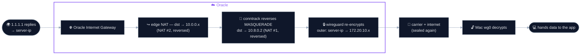

# ColdVPN — Architecture & Decisions

🔗 [Main README](../README.md) · 🔧 [Developer guide](../DEVELOPER.md)

A record of the key design decisions, one file each — short "why this, not that"
notes, written as the reasoning, not just the result.

| # | Decision | Why |
|---|----------|-----|
| [01](decisions/01-wireguard-vs-tls-relay.md) | WireGuard, not a TLS relay | a TLS relay is TCP-in-TCP (melts down on lossy links), TCP-only (leaks UDP/QUIC), and a shared token is weaker than asymmetric keys |
| [02](decisions/02-mac-not-iphone.md) | The Mac runs the VPN, not the iPhone | iOS can't tunnel a tethered Mac and needs a $99 entitlement; macOS does it free |
| [03](decisions/03-cli-vs-app.md) | CLI vs the App Store app (ship both) | the app's tunnel is sandboxed (no CLI stats) — so we used the CLI for a custom widget; now the app shows stats natively, so we offer both |
| [04](decisions/04-dns-through-tunnel.md) | DNS through the tunnel, not direct | resolving direct leaks every domain you visit (the one cleartext metadata); routing via the VPS closes that leak, and TLS certs backstop any tampering on the VPS→resolver leg |

## At a glance
```
your Mac → [WireGuard encrypted tunnel] → your VPS → internet
```
- **UDP, packet-level (L3)** — carries every protocol, no TCP-over-TCP meltdown
- **asymmetric keys** — the private key never leaves the device
- **runs on the Mac** — free utun, protects the Mac's own traffic
- **two ways to run it** — the App Store app (easy) or the CLI (advanced)

## How a packet travels (Mac → 1.1.1.1, via Oracle)

WireGuard wraps each packet in an **outer envelope** (Mac → server, UDP 443)
around the sealed **inner packet** (tunnel address → real destination). Two NATs
carry it the rest of the way:

- **NAT #1 — in the VM, ours.** `setup.sh` PostUp adds `iptables ... MASQUERADE -o
  ens3`; it rewrites the decrypted packet's source from the tunnel IP to the VM's
  private IP.
- **NAT #2 — Oracle's edge, automatic.** A 1:1 map between the VM's **public IP**
  and its **private IP** (`10.0.0.x`): rewrites the destination inbound, the
  source outbound.

**Outbound** (Mac → 1.1.1.1):

```mermaid
%%{init: {'theme':'base','themeVariables':{'primaryColor':'#0f172a','primaryTextColor':'#e5e7eb','primaryBorderColor':'#475569','lineColor':'#94a3b8','fontSize':'14px'}}}%%
flowchart LR
    App["💻 app on your Mac<br/>wants 1.1.1.1"] --> WG["🔒 wg0 encrypts<br/>inner: 10.8.0.2 → 1.1.1.1"]
    WG --> NIC["📤 Mac NIC / iPhone hotspot<br/>outer: 172.20.10.x → server-ip:443"]
    NIC --> ATT["📡 carrier + internet<br/>see only a sealed<br/>UDP-443 stream to the server"]
    ATT --> IGW["🌐 Oracle Internet Gateway"]

    subgraph ORACLE["☁️ Oracle"]
        direction TB
        IGW --> E1["edge 1:1 NAT — dst → 10.0.0.x:443<br/>(NAT #2, inbound)"]
        E1 --> ING{"🛡️ security list:<br/>UDP 443 allowed?"}
        ING -->|"no"| DROP["⛔ dropped"]
        ING -->|"yes"| ENS3["🖥️ VM NIC ens3 (10.0.0.x)"]
        ENS3 --> DEC["🔓 wireguard decrypts<br/>→ 10.8.0.2 → 1.1.1.1"]
        DEC --> FWD["➡️ kernel forwards<br/>(ip_forward=1 + FORWARD accept)"]
        FWD --> N1["🔁 iptables MASQUERADE<br/>src → 10.0.0.x (NAT #1, ours)"]
        N1 --> E2["↩️ edge NAT<br/>src → server-ip (NAT #2, outbound)"]
    end
    E2 --> NET(["🌍 internet sees:<br/>server-ip → 1.1.1.1"])

    style ORACLE fill:none,stroke:#8b5cf6,stroke-width:2px,color:#8b5cf6
```



| hop | outer (envelope) | inner (sealed) |
|---|---|---|
| Mac, after encrypt | `172.20.10.x → server-ip:443` | `10.8.0.2 → 1.1.1.1` |
| across carrier + net | same | unreadable |
| Oracle edge (NAT #2) | dst → `10.0.0.x:443` | unreadable |
| ens3 → decrypt | — opened — | `10.8.0.2 → 1.1.1.1` |
| forward + NAT #1 | — | src → `10.0.0.x` |
| Oracle edge (NAT #2) | — | src → `server-ip` |

**Return** (1.1.1.1 → Mac) is the mirror — the two NATs run in reverse off
conntrack, then WireGuard re-wraps it:


