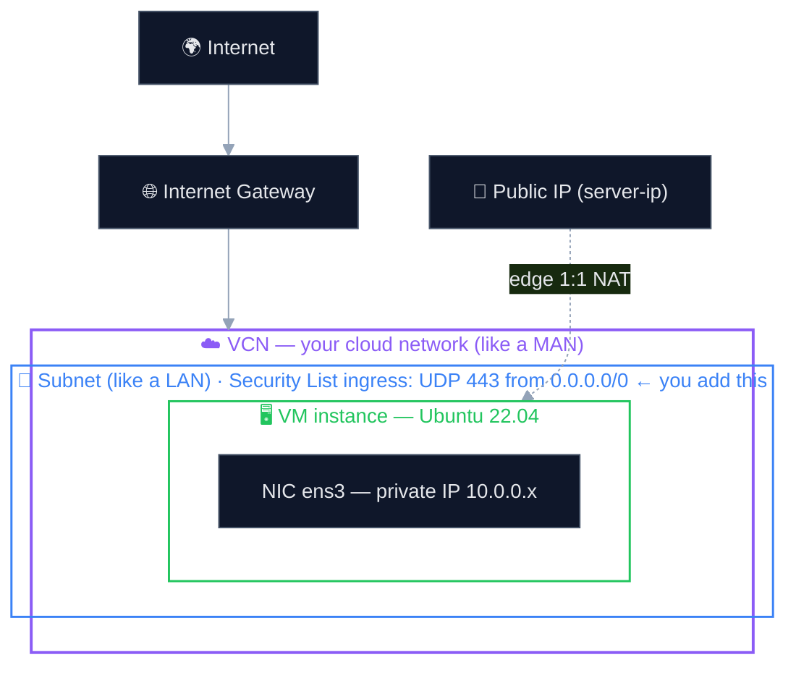

# Creating the server

> The one part of ColdVPN that isn't scripted — spinning up the Ubuntu VM that
> `setup.sh` later runs on. It happens by hand in your cloud provider's console,
> because there's no server to automate against yet.

ColdVPN needs a small, always-on Linux box to act as the VPN exit node.
[Oracle Cloud's **Always Free** tier](https://www.oracle.com/cloud/free/) is a
good fit (a free 24/7 VM), but any Ubuntu VPS works the same way.

## The pieces you create (and how they nest)

Creating an instance in Oracle also creates the network around it. Think of the
**VCN** as a private MAN, the **subnet** as a LAN inside it, and the **VM** as one
host on that LAN. The only thing you usually add by hand is the **ingress rule**.



`setup.sh` later runs *inside* the VM and uses both addresses: the **public IP**
is how clients reach it, and the **private `ens3` IP** is what NAT masquerades
traffic to on the way out. ([full packet path](../client/ARCHITECTURE.md))

---

## 1. Make an account
Sign up at **oracle.com/cloud/free**. Always Free resources don't expire.
(A card is needed for identity verification; Always Free shapes aren't charged.)

## 2. Create the instance
Console → **Compute → Instances → Create instance**:

- **Image** — Ubuntu 22.04
- **Shape** — an **Always Free-eligible** one (e.g. `VM.Standard.A1.Flex`)
- **SSH keys** — paste your *public* key (`~/.ssh/id_ed25519.pub`) so you can log in
- Create, then note the **public IP** it's assigned.

## 3. Open the WireGuard port
WireGuard here listens on **UDP 443**. Open it on the instance's subnet:

Console → **Networking → Virtual Cloud Networks → (your VCN) → Security Lists →
Default Security List → Add Ingress Rule**

- Source CIDR — `0.0.0.0/0`
- IP Protocol — **UDP**
- Destination Port — **443**

> The VCN and subnet are created automatically with the instance — usually you
> only add this one ingress rule.

## 4. Log in
```bash
ssh ubuntu@<your-server-ip>
```

Then come back to the [README](../README.md) and run the server installer.

---

> 🚧 **TODO:** expand with screenshots and a full click-through walkthrough.
