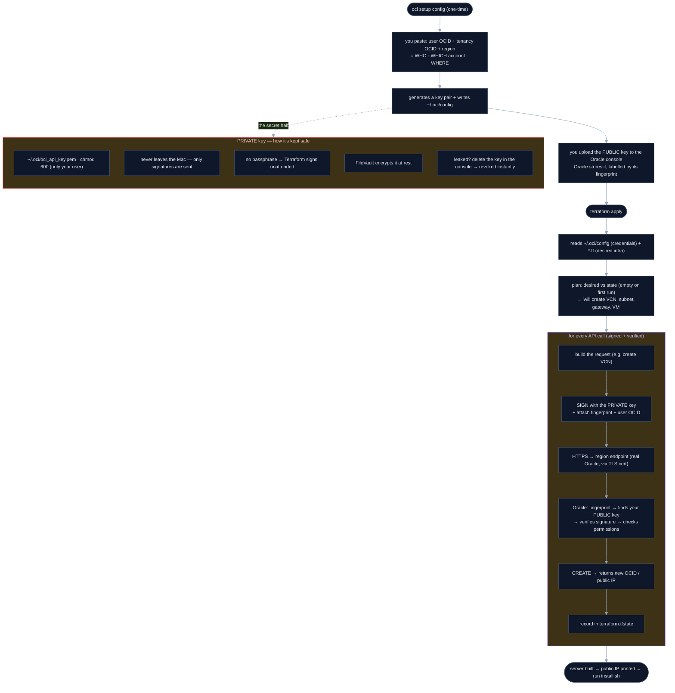

# Provision the server with Terraform

Stands up the whole Oracle server from nothing — VCN → subnet → internet gateway
→ firewall (SSH + WireGuard UDP) → Ubuntu VM — in one command, instead of clicking
through the console. Why Terraform (and not a GUI agent or the raw `oci` CLI):
[decision 08](../../client/decisions/08-provisioning-terraform.md).

> ⚠️ **Status: untested against a live tenancy.** The config is written but hasn't
> been `apply`-ed on a real account yet. Run `terraform plan` first and read it
> before `apply`. Treat the first run as the test.

## One-time setup (the human bits — can't be scripted)

1. **An Oracle Cloud account** (Always-Free is fine). Signup needs identity/card
   verification — there's no way around that.
2. **Terraform** — install the **prebuilt binary**:
   ```bash
   TFVER=$(curl -fsSL https://checkpoint-api.hashicorp.com/v1/check/terraform \
     | sed -n 's/.*"current_version":"\([^"]*\)".*/\1/p')
   ARCH=$([ "$(uname -m)" = "arm64" ] && echo arm64 || echo amd64)
   curl -fsSLO "https://releases.hashicorp.com/terraform/$TFVER/terraform_${TFVER}_darwin_${ARCH}.zip"
   unzip -o "terraform_${TFVER}_darwin_${ARCH}.zip" terraform
   sudo mv terraform /usr/local/bin/        # Apple Silicon: mv terraform /opt/homebrew/bin/
   terraform version
   ```
   > **Why not `brew install terraform`?** Homebrew dropped `terraform` from core
   > (HashiCorp's BUSL license change), and HashiCorp's tap **builds it from
   > source**, which needs current Xcode Command Line Tools — easy to be outdated.
   > The prebuilt binary has **nothing to compile**, so it sidesteps both. (If your
   > Command Line Tools are current, `brew install hashicorp/tap/terraform` also
   > works.)
3. **An API key** so Terraform can authenticate. Easiest:
   ```bash
   brew install oci-cli      # only needed for this one-time setup step
   oci setup config          # creates an API key + ~/.oci/config; upload the
                             # generated public key in the OCI console when prompted
   ```
   (You can also create the key by hand in the console and write `~/.oci/config`
   yourself — Terraform just reads that file. The `oci` CLI isn't used after this.)

## Run it

```bash
cd server/provision
cp terraform.tfvars.example terraform.tfvars   # then fill in your values
terraform init      # downloads the OCI provider
terraform plan      # preview — shows exactly what it will create, no changes
terraform apply     # builds it; prints the server's public IP
```

When `run_setup_on_boot = true` (the default), the VM runs `setup.sh` on first
boot via cloud-init, so WireGuard is installed automatically. Then on your Mac:

```bash
cd ../.. && ./install.sh        # use the public_ip Terraform printed
```

## Under the hood — from credentials to a running server

The whole flow, and *why* each step exists: you paste 3 IDs, a key is minted,
and Terraform uses it to sign every API call that builds your server. The private
key is the crown jewel — its safety branch is on the right.



Key idea: the OCIDs say *who/which/where*, the key pair *proves it's you* (private
signs, public verifies, fingerprint picks the right key), and HTTPS *proves you're
talking to real Oracle*. Together that's what lets `terraform apply` build your
server safely on every call.

## Tear it down

```bash
terraform destroy   # removes the VM + network it created, no leftovers
```

This is what makes a **throwaway test server** cheap: `apply` to create, `destroy`
to wipe — Terraform tracks everything it made, so nothing lingers or costs money.

## Notes
- **Always-Free A1 capacity**: `VM.Standard.A1.Flex` is in high demand and `apply`
  can fail with an out-of-capacity error. Retry later, switch region, or set
  `instance_shape = "VM.Standard.E2.1.Micro"` in `terraform.tfvars`.
- `terraform.tfvars` and `*.tfstate` are git-ignored — they hold your OCIDs / key
  and resource details.
- Reusing an existing VCN instead of creating one? That's a different setup — this
  recipe creates its own network so `destroy` stays clean.
