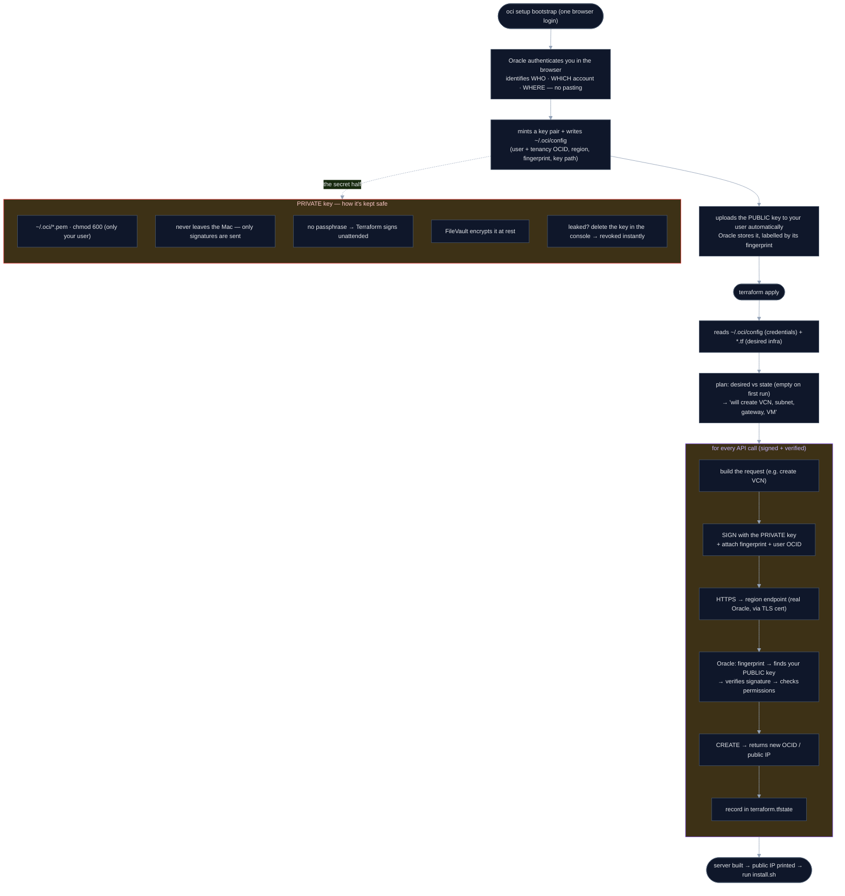

# Provision the server with Terraform

Stands up the whole Oracle server from nothing — VCN → subnet → internet gateway
→ firewall (SSH + WireGuard UDP) → Ubuntu VM — in one command, instead of clicking
through the console. Why Terraform (and not a GUI agent or the raw `oci` CLI):
[decision 08](../../client/decisions/08-provisioning-terraform.md).

## What you do by hand

One thing: **create a free Oracle Cloud account** at
<https://signup.cloud.oracle.com> (Always-Free is fine). Signup needs credit-card
+ SMS verification — Oracle requires a human and exposes no API for it, so this
step can't be scripted. It's the only manual step.

## Run it

```bash
cd server/provision
./provision.sh
```

`provision.sh` does everything else, with **nothing to paste**:

- installs the **OCI CLI** and **Terraform** if they're missing
- `oci setup bootstrap` — **one browser login**: it mints an API signing key,
  uploads it to your user, and writes `~/.oci/config` for you (so the user/tenancy
  OCIDs, region, key, and fingerprint are all filled in automatically)
- reads your tenancy OCID + region back out of that config, and generates an SSH
  key if you don't have one
- `terraform apply` — builds the network + VM
- **waits for the server to be ready** — the VM boots and cloud-init installs
  WireGuard in the background, so provision.sh polls until SSH answers *and*
  `wg show wg0` succeeds (the exact thing install.sh's key exchange needs)
- **offers to run `install.sh`** — once ready, it asks *"Configure this Mac
  now?"*. Say yes and it runs install.sh with the server IP handed over
  automatically (no copy-paste); say no and it prints the command to run later

So a fresh setup is really just: create an Oracle account → `./provision.sh` →
one browser login → answer "yes" to configure the Mac. Nothing typed or pasted
in between.

> `install.sh` reconfigures *this Mac* (needs your password, turns the VPN on),
> which is why the hand-off asks first rather than running silently.

### Driving Terraform yourself

`provision.sh` is just a wrapper. Once `~/.oci/config` exists (from
`oci setup bootstrap` or your own setup), you can run Terraform directly —
passing `compartment_ocid` + `ssh_public_key` via `terraform.tfvars` or
`TF_VAR_*` env vars, with region read from your config profile:

```bash
terraform init && terraform plan && terraform apply
```

## Under the hood — from credentials to a running server

A browser login mints a key, Oracle stores its public half, and Terraform uses the
private half to sign every API call that builds your server. The private key is the
crown jewel — its safety branch is on the right.



Key idea: the bootstrapped config says *who/which/where*, the key pair *proves it's
you* (private signs, public verifies, fingerprint picks the right key), and HTTPS
*proves you're talking to real Oracle*. Together that's what lets `terraform apply`
build your server safely on every call.

## Tear it down

```bash
terraform destroy   # removes the VM + network it created, no leftovers
```

This is what makes a **throwaway test server** cheap: `apply` to create, `destroy`
to wipe — Terraform tracks everything it made, so nothing lingers or costs money.

## Notes
- **Always-Free A1 capacity**: `VM.Standard.A1.Flex` is in high demand and `apply`
  can fail with an out-of-capacity error. The default is the reliably-available
  `VM.Standard.E2.1.Micro`; switch with `instance_shape` in `terraform.tfvars`.
- `terraform.tfvars` and `*.tfstate` are git-ignored — `tfvars` (if you create it)
  may hold OCIDs/keys, and state holds resource details.
- Reusing an existing VCN instead of creating one? That's a different setup — this
  recipe creates its own network so `destroy` stays clean.
